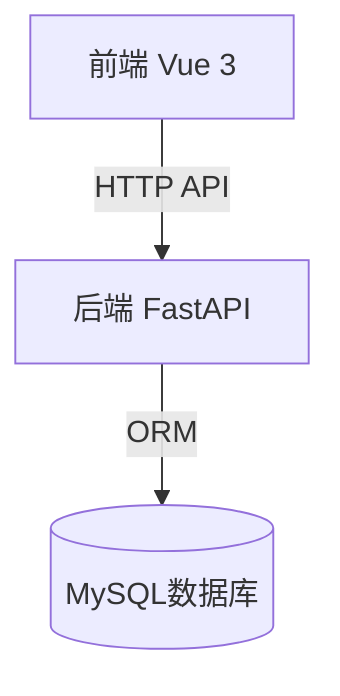
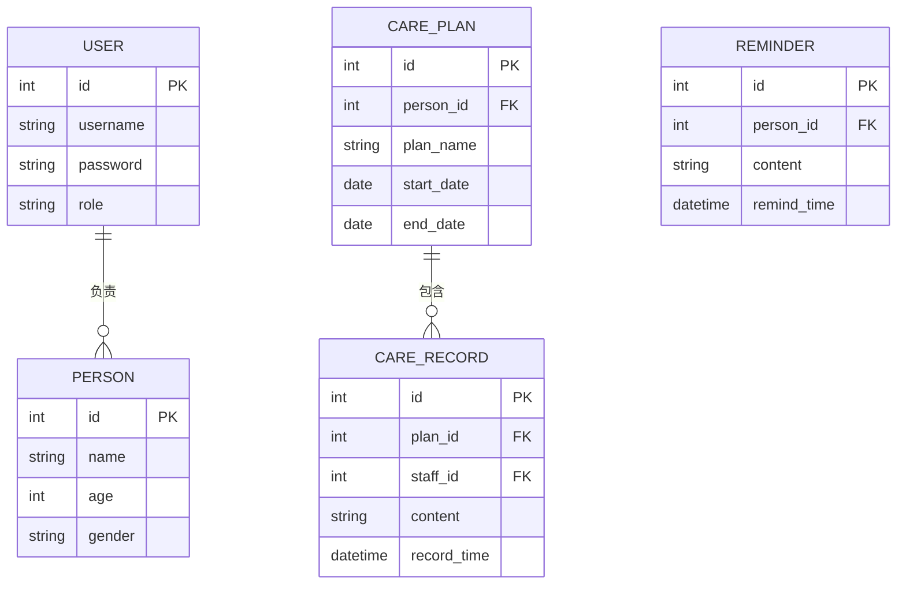
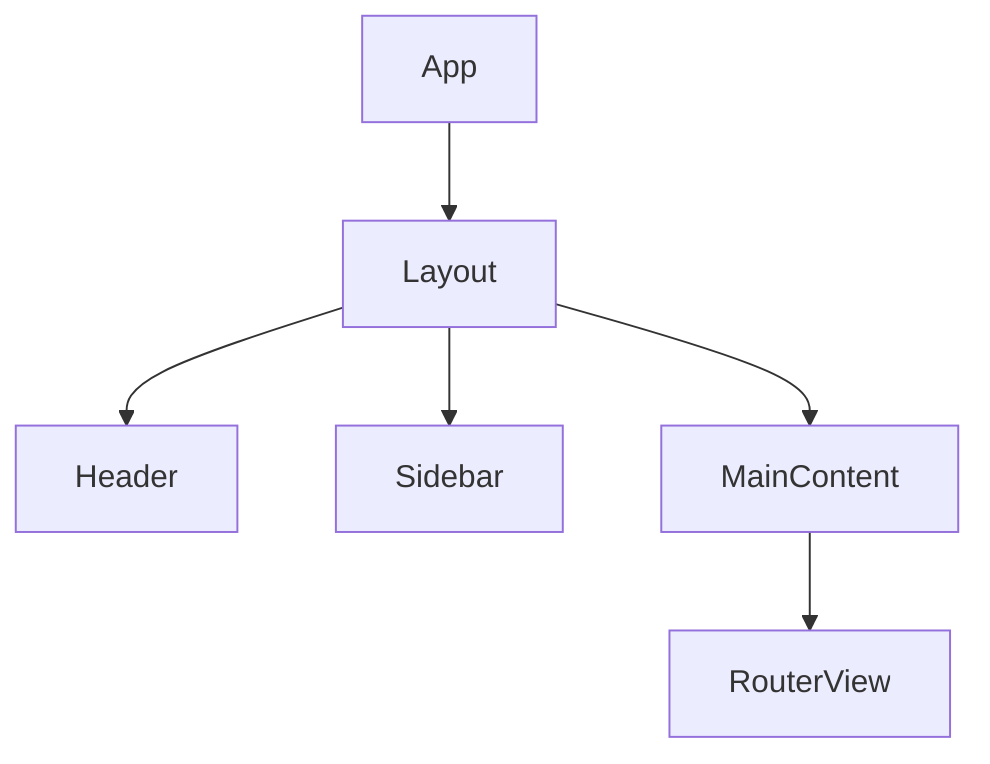

# GoldenYearsManager 系统设计文档

## 1. 系统架构设计

### 1.1 整体架构


### 1.2 技术栈
- 前端：Vue 3 + TypeScript + Vite + Pinia + Vue Router
- 后端：Python + FastAPI + SQLAlchemy + MySQL
- 部署：Docker + Nginx(or Apache2)

## 2. 功能模块设计

### 2.1 用户管理模块
- 用户角色：管理员、护理人员
- 功能：
  - 用户注册/登录(JWT认证)
  - 用户信息管理
  - 权限控制

### 2.2 老人信息管理模块
- 老人基本信息维护
- 健康档案管理
- 家属关联

### 2.3 护理计划模块
- 护理计划创建/修改
- 计划任务分配
- 计划进度跟踪

### 2.4 护理记录模块
- 日常护理记录
- 特殊情况记录
- 记录查询统计

## 3. 数据库设计

### 3.1 ER图


### 3.2 主要表结构
- users: 用户表
- persons: 老人信息表
- care_plans: 护理计划表
- care_records: 护理记录表

## 4. API设计规范

### 4.1 通用规范
- 使用RESTful风格
- 响应格式：
```json
{
    "code": 200,
    "message": "success",
    "data": {}
}
```

### 4.2 主要API端点
- /api/auth: 认证相关
- /api/users: 用户管理
- /api/persons: 老人信息管理
- /api/care_plans: 护理计划管理
- /api/care: 护理记录管理

## 5. 前端组件设计

### 5.1 主要组件结构


### 5.2 核心组件
- Auth: 认证相关组件
- User: 用户管理组件
- Person: 老人信息组件
- CarePlan: 护理计划组件
- CareRecord: 护理记录组件

## 6. 安全设计

### 6.1 认证授权
- JWT认证
- 基于角色的访问控制(RBAC)

### 6.2 数据安全
- 敏感数据加密存储
- API请求签名验证
- SQL注入防护

